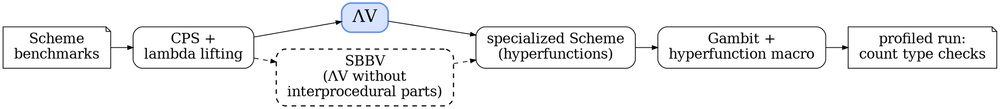

# ΛV Experimental Results {#lv-experiments-title layout=title}

# ΛV: Experimental Setup {#lv-setup .small}

Implemented source to source: Scheme in, specialized Scheme out, run on **Gambit**



::::: columns
::: column {width=1fr}
{.reveal}
:::: group
### 27 benchmarks

12 macro, over 400 lines

15 micro: `fib`, `tak`, `sum`...
::::
::: /column
::: column {width=1fr}
{.reveal}
:::: group
### 60 configurations

3 heuristics, 2 operator forms

Version limit 1 to 10
::::
::: /column
::: column {width=1fr}
{.reveal}
:::: group
### 3 measures

Type checks executed

Compile time, code duplication
::::
::: /column
:::::

::: detour {#lv-no-time label="Why no execution time?" key=e}
# Why No Execution Time? {#lv-no-time-slide .small}

::: columns
::: column {width=1fr}
{#hf-points .reveal}
- Code is converted to **multi-barreled CPS**: one continuation per return point
- **No native implementation** of hyperfunctions: a Scheme macro emulates them, slower than the source program
::: /column
::: column {width=1fr}
```code {#hf-code lang=racket file="programs/hyperfunction-square.scm" title="square, calling * as a hyperfunction"}
```
::: /column
::: /columns

```arrow {#hf-arrow}
steps:
  - null
  - {from: "hf-points[1]", from_anchor: bottom, to: hf-code, to_anchor: left}
  - null
```

```timeline
reveal 1, hf-arrow 1     # first bullet, arrow to the hyperfunction
reveal 2, hf-arrow 2     # second bullet, arrow gone
```

::: notes
Thesis Section 3.2.2, 3.5.1 and 3.7. ΛV turns every function into a hyperfunction: after CPS
conversion and lambda lifting, each block is a lambda that receives its live variables and its
return points as continuations (K[0], K[1], K[2]), so a call passes one continuation per return
point. The example is square from the thesis (Section 3.2.2), specialized with three entry points
(any, fx, fl), each dispatching to a specialized entry point of the * operator, itself a
hyperfunction; the call to * is a tail call, so square passes its own return points through.
The slide elides the bodies of A2 and A3 (thesis listing: A2 calls *.fx×arg[0] with K[0] and
K[2], A3 calls *.fl×arg[0] with K[1]).
There is no native implementation of hyperfunctions yet: the experiments use the Scheme macro of
Appendix B, which only shows that a working interface takes little effort, and programs in this
representation always run slower than their source. Execution time would measure the macro, not
ΛV, so type checks are the metric. Native designs exist (Section 3.6): extended flat closures and
pre-allocated return point tables cost a single indirection per call and return. Implementing
hyperfunctions natively is future work.
:::
::: /detour

::: notes
Thesis Section 3.5.1 and Appendix C. ΛV works on source code: preprocessing (desugaring, alpha
conversion, assignment conversion, then CPS and lambda lifting) turns every lambda into an
unspecialized hyperfunction, and ΛV outputs valid Scheme, run here on Gambit with the
hyperfunction macro. SBBV is reimplemented by disabling the interprocedural parts of ΛV, so the
gap between the two is exactly what interprocedural propagation removes. Unlike Chapter 2, no
other compiler optimization interferes (no inlining or constant folding noise), and only type
checks are tracked: no interval analysis, so no overflow or bounds checks. Benchmarks: the R7RS
subset used for SBBV plus fact20 and fact100; micro under 400 lines, macro over. Each one is
profiled without specialization, then with ΛV and SBBV at version limits 1 to 10, for the three
merge heuristics and both operator representations. compiler (about 12,000 lines, 1,500
functions) is left out of the geometric means: it timed out (2.5 hours) at high limits. Compile
time is the versioning algorithm only, on an Intel Core i7-7700K with 48 GB, Debian 10. The
detour (key e) explains why execution time is not measured.
:::

::include{file="plots/lv-typechecks.md"}
::include{file="plots/lv-compile-time.md"}
::include{file="plots/lv-versions.md"}
