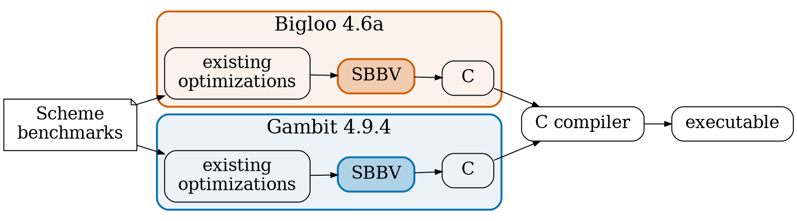

# SBBV Experimental Results {#sbbv-experiments-title layout=title}

# SBBV: Experimental Setup {#sbbv-setup .small}

Implemented in two production-ready Scheme compilers: **Bigloo** and **Gambit**

::::: columns
::: column {width=1fr}
{.reveal}
:::: group
### 19 benchmarks

12 macro, up to 11,740 lines

7 micro: `fib`, `tak`, `ack`...
::::
::: /column
::: column {width=1fr}
{.reveal}
:::: group
### 8 configurations

No SBBV: own optimizations

Version limit 1 to 5, 10, 20
::::
::: /column
::: column {width=1fr}
{.reveal}
:::: group
### 4 measures

Dynamic checks, program size

Execution and compile time
::::
::: /column
:::::

::: detour {#sbbv-context label="Already fast?" key=f}
# Bigloo and Gambit Are Already Fast {#sbbv-context-table .small}

Execution time in seconds, SBBV with a limit of 2 versions (bold: fastest)

| Program     | Node.js | Bigloo | Bigloo + SBBV | Gambit | Gambit + SBBV | Chez  | Racket |
|-------------|--------:|-------:|--------------:|-------:|--------------:|------:|-------:|
| `almabench` | **6.31**| 15.68  | 14.46         | 14.64  | 13.86         | 17.69 | 19.30  |
| `boyer`     | 40.31   | 7.40   | 7.22          | 8.21   | **6.49**      | 8.09  | 12.38  |
| `earley`    | 56.75   | 14.90  | 13.83         | 10.87  | 10.34         | **9.53** | 24.73 |
| `leval`     | 18.42   | 7.53   | **6.47**      | 12.03  | 9.74          | 7.16  | 16.96  |
| `maze`      | 10.07   | 7.47   | 6.70          | 6.75   | **5.73**      | 12.01 | 12.12  |
| `bague`     | 305.04  | 12.90  | **11.19**     | 15.54  | 12.93         | 21.01 | 19.33  |

{.reveal}
With SBBV, both compilers get faster on every program

::: notes
Thesis Appendix D, Figure 14 (Section 4.5, "Putting the Results in Context"). Node.js 21.7.1,
Bigloo 4.6a, Gambit 4.9.4-377, Chez Scheme 9.5.1, Racket 7.2. The programs have Scheme and
JavaScript versions from previous work, a subset of the benchmark suite. Without SBBV, Gambit and
Bigloo beat Node.js on every program except almabench (V8 has special optimizations for floats
and arrays), up to 24× faster on bague, and are in the same ballpark as Chez Scheme. So the gains
of SBBV are measured against compilers that are already competitive.
:::
::: /detour

::: notes
SBBV was added as a pass in the CFG pipeline of two independently developed, mature optimizing
ahead-of-time Scheme to C compilers, which are also back ends of compilers for JavaScript and
Python. They already implement constant folding, inlining, flat closures, lambda lifting: any
gain is on top of years of tuning. Merge heuristic: similarity (merge the most similar versions).
To count checks, every primitive is redefined by a macro with explicit inline checks (type,
overflow, array bounds), so both compilers perform the same checks in the same order; counting
runs are separate from timing runs. Timing: perf stat, each run at least 5 s, 50 runs with the 5
highest and 5 lowest removed; relative standard deviation at most 0.24% (macro) and 2.20% (micro).
Intel Core i7-7700K, 48 GB, Debian 10. Micro benchmarks only shed light on specific behaviours.
The detour (key f) shows that the baseline compilers are already competitive with Node.js and
Chez Scheme.
:::

::include{file="plots/sbbv-checks.md"}
::include{file="plots/sbbv-size.md"}
::include{file="plots/sbbv-time.md"}
::include{file="plots/sbbv-compile-time.md"}
